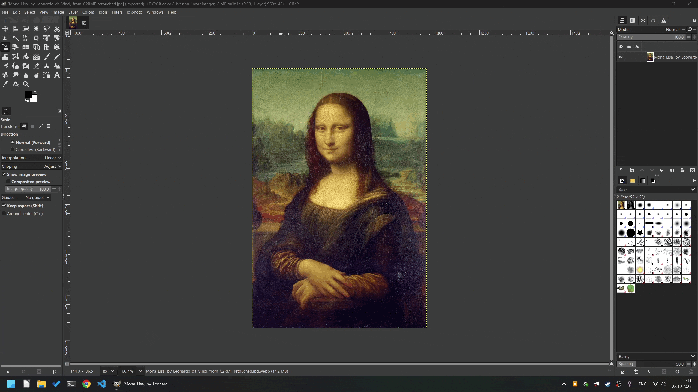

# GIMP3 plugins for creating ID photos
- Copies an image to a specified document photo format
- Copies an image in a specified quantity to a specified paper size for printing
- Saves the photo to an archive

# How to install
For windows
copy folders from repo to C:\Users\{your_id}\AppData\Roaming\GIMP\3.0\plug-ins
